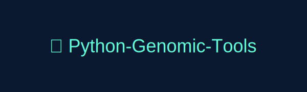

<p align="center">
  
</p>

# 🧬 Python-Genomic-Tools

A lightweight and modular toolkit for analyzing and manipulating genomic data in Python.  
Developed by **Rahul Anand (r.anand@exeter.ac.uk)** at Farrer Lab.

---

## 🚀 Features

- 🧩 **VCF Parsing & Annotation**
  - Parse and annotate VCFs using reference FASTA + GFF3
  - Detect SNPs, INDELs, frameshifts, stop-gained/lost mutations
  - Reports gene, alias, and feature information

- 🧬 **FASTA Tools**
  - Parse FASTA sequences and compute GC %, ambiguous bases, and length stats
  - Translate DNA → amino acid sequences using the standard genetic code
  - Build per-sample FASTA consensus sequences from VCFs

- 🧫 **GFF Parser**
  - Extract gene, CDS, exon, and UTR coordinates
  - Supports parent–child hierarchy for accurate gene mapping

- 📊 **VCF Filters & Stats**
  - Filter by read depth and ambiguous sites
  - Summarize homozygous and heterozygous variant counts by type

---

## 🛠️ Installation

```bash
git clone https://github.com/DarthRahul27/Python-Genomic-Tools.git
cd Python-Genomic-Tools
